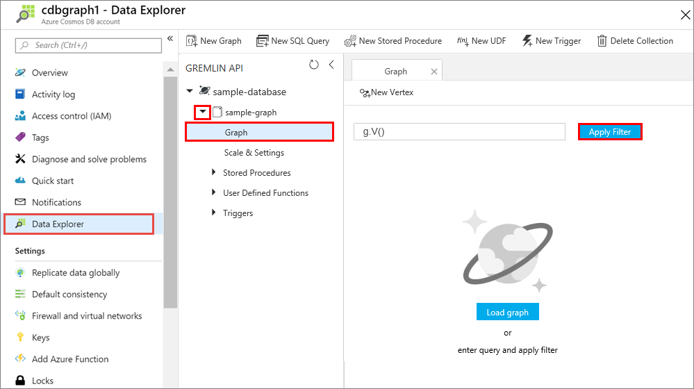

# use the neo4J sample data with azure cosmosdb 

## About this sample

> This sample demostrate how to load the CSV file in cosmosdb provide by neo4 J for sample 

### Overview

This sample demonstrates a Python application that will load a graph based on CSV samples 

1. a python loader will load 2 CSV in a graph database ( one for the edges , one for the vertex )  


## How to run this sample

To run this sample, you'll need:

> - [Python 2.7+](https://www.python.org/downloads/release/python-2713/) or [Python 3+](https://www.python.org/downloads/release/python-364/)

> - An Azure cosmosdb account 


### Step 1:  Clone or download this repository

From your shell or command line:

```Shell
git clone https://github.com/emdeletaede/gremlinssamplecosmosdb.git
```

or download and extract the repository .zip file.

> Given that the name of the sample is quite long, you might want to clone it in a folder close to the root of your hard drive, to avoid file name length limitations when running on Windows.

### Step 2:  install the pre-requisite python library 


- You will need to install dependencies using pip as follows:
```Shell

$ Python -m pip install azure-cosmos
$ Python -m pip install gremlin_python


```

change the db name , the key and endpoint of your cosmosdb . add your graph previously create in a graph API cosmosdb if you don't know how to do this refer to 
https://docs.microsoft.com/en-us/azure/cosmos-db/create-graph-python where how to create a graph is explaiin 


### Step 3:  Run the application  to load the graph 

```Shell
$ python connecthidde.py


```
### step 4 Review and consume the data 
After the vertices and edges are inserted, you can now go back to Data Explorer and see the vertices added to the graph, and add additional data points.

In your Azure Cosmos DB account in the Azure portal, select Data Explorer, expand sample-graph, select Graph, and then select Apply Filter.

  

In the Results list, you can see the graph. You can move the vertices around by dragging and dropping, zoom in and out by scrolling the wheel of your mouse, and expand the size of the graph with the double-arrow.

some gremlins query you can execute are 

g.V().count() to have the number of objects. 

g.V().has('name', 'CANADIAN BANK OF COMMERCE')  to find the object with specific name 

g.V().hasLabel('company').outE('10').inV().hasLabel('company').outE('14').inV().hasLabel('company') find all the company where a director stay 10 years and 14 years ... 

g.V().hasLabel('company').has('name', TextP.startingWith( 'CANADIAN')) find all the company where name start with CANADIAN


